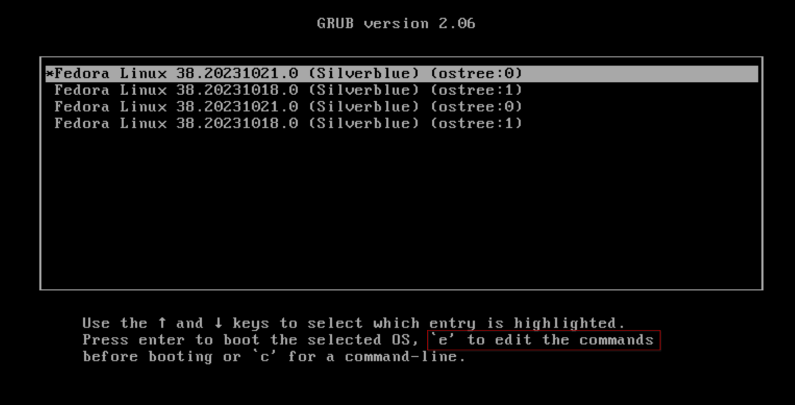
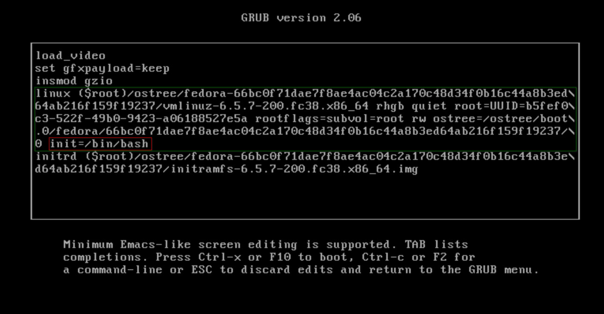
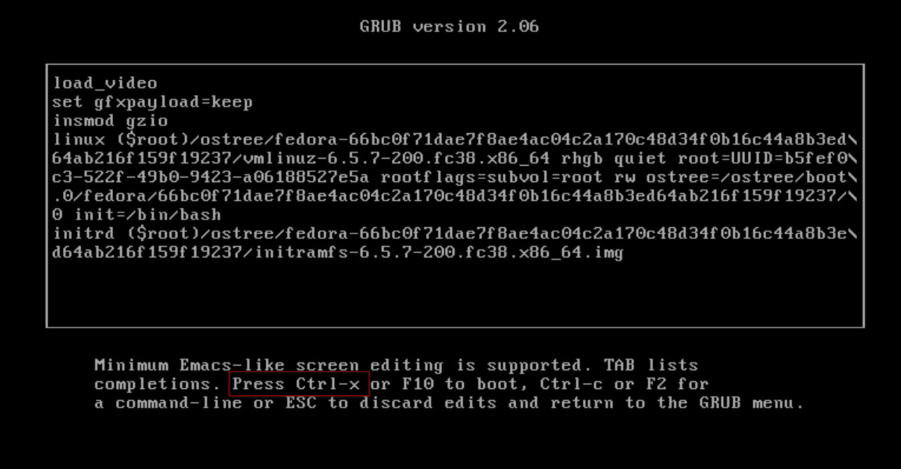

---
authors:
  - "@nicknamenamenick"
  - "@noelmiller"
---

<!-- ANCHOR: METADATA -->
<!--{"url_discourse": "https://universal-blue.discourse.group/docs?topic=161", "fetched_at": "2024-09-03 16:43:11.636024+00:00"}-->
<!-- ANCHOR_END: METADATA -->

> This method is only if you forgot your current user password! Changing your current password should be done through the desktop environment.

> Follow this guide **at your own discretion** because you can break your system attempting any of this.

Reboot your device and edit the last deployment by presssing <kbd>E</kbd> on your keyboard.

Boot with `init=/bin/bash` on the kernel command line (e.g. edit GRUB prompt.)

Continue boot process with <kbd>Ctrl</kbd>+<kbd>X</kbd>

Once you are in the GRUB command line:

1. Temporarily mount SELinux

    `mount -t selinuxfs selinuxfs /sys/fs/selinux`

2.  Load SELinux policy

    `/sbin/load_policy`

3. Enter your new password (i.e. `passwd bazzite`)

    `passwd [INSERT USERNAME HERE]`

4. Sync

    `sync`

5. Reboot

    `/sbin/reboot -ff`

Your user password should now be reset.

>Thanks to [Colin Walters](https://github.com/cgwalters) for the [solution](https://github.com/ublue-os/main/issues/469#issuecomment-1885264886).

[**<-- View all Bazzite documentation**](https://docs.bazzite.gg)
