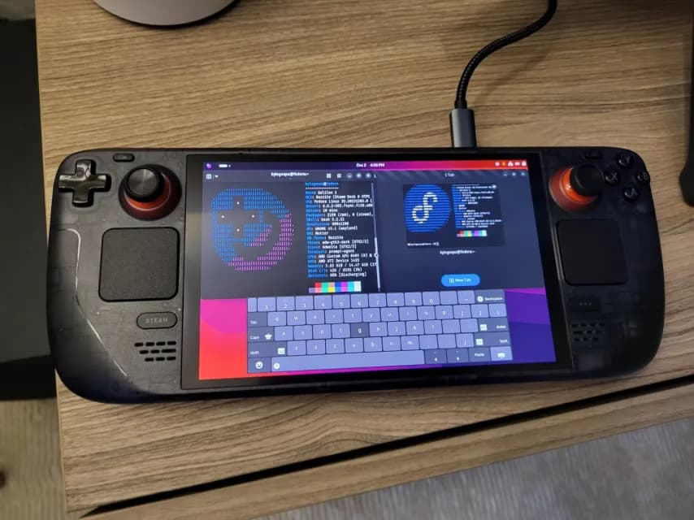

---
authors:
  - "@nicknamenamenick"
---

<!-- ANCHOR: METADATA -->
<!--{"url_discourse": "https://universal-blue.discourse.group/docs?topic=1849", "fetched_at": "2024-09-03 16:43:16.550432+00:00"}-->
<!-- ANCHOR_END: METADATA -->

## Steam Deck LCD (256GB+)


**Status**: Platinum

## Installing Bazzite

Read the [**Installing Bazzite on Handheld PCs documentation**](/src/General/Installation_Guide/Installing_Bazzite_for_Steam_Deck.md).

### Post-Installation Setup

- No additional setup required, but make sure to read the [installation Guide](/src/General/Installation_Guide/Installing_Bazzite_for_Steam_Deck.md).
- It should function nearly identical to SteamOS with the benefits of [Fedora Atomic Desktop](https://fedoraproject.org/atomic-desktops/):
  - Layer Fedora packages to the image without losing them between updates/reboots.
  - Newer package upgrades including the Linux kernel and drivers.
  - Printing support and other basic features that would make Bazzite viable for daily usage.
- View our [FAQ](https://faq.bazzite.gg) for more information.

## Steam Deck OLED



**Status**: Platinum

## Installing Bazzite

Read the [**Installing Bazzite on Handheld PCs documentation**](/src/General/Installation_Guide/Installing_Bazzite_for_Steam_Deck.md).

### Post-Installation Setup

- No additional setup required, but make sure to read the [installation Guide](/src/General/Installation_Guide/Installing_Bazzite_for_Steam_Deck.md).
- It should function nearly identical to SteamOS with the benefits of [Fedora Atomic Desktop](https://fedoraproject.org/atomic-desktops/):
  - Layer Fedora packages to the image without losing them between updates/reboots.
  - Newer package upgrades including the Linux kernel and drivers.
  - Printing support and other basic features that would make Bazzite viable for daily usage.
- View our [FAQ](https://faq.bazzite.gg) for more information.

<hr>

## How similar is Bazzite to SteamOS on Steam Deck hardware?

Bazzite should have most of the functionality from SteamOS with Steam Gaming Mode working as intended.

Bazzite Steam Deck images include the latest Gamescope and packages, which means we are always ahead of SteamOS in terms of Steam Gaming Mode and Desktop Mode features.

The Quick Access Menu (accessed with the <kbd>...</kbd> button on Steam Deck) is functional for TDP, framerate limiting, scaling, etc.

Third-party software like [Decky Loader](https://decky.xyz/), [Emudeck](https://www.emudeck.com/), [RetroDeck](https://retrodeck.net/), etc. should install and function properly.

## Why should I use Bazzite over SteamOS?

Bazzite is great for users who feel that the device is too limited by SteamOS in comparison to other Linux operating systems, but do not want to sacrifice Steam Gaming Mode, stability, and the user friendliness of SteamOS.

### Enhancements

- Shares packages from SteamOS
- Works on different hardware configurations (desktops, handhelds, etc.)
- Android applications can be installed with [Waydroid](/Installing_and_Managing_Software/Waydroid_Setup_Guide.md)
- Updating in Steam Gaming Mode will also update installed applications
- Access to multiple desktop environments
  - KDE
  - GNOME
  - Budgie (**coming soon**)

### Daily Driving

- System packages that get updated on a regular basis
  - Follows Fedora's [update cycle](https://docs.fedoraproject.org/en-US/releases/lifecycle/) and receive updates directly from upstream
    - This includes graphics drivers, the Linux kernel, and desktop environment upgrades
- Security focused with the [Security Enhanced Linux](https://www.redhat.com/en/topics/linux/what-is-selinux) kernel module enabled by default
- Printing support out of the box
- Wayland is the default session for Desktop Mode

### Tinkering

- Access to multiple package managers and repositories in [containers](https://universal-blue.discourse.group/docs?topic=44)
- [Layer](https://universal-blue.discourse.group/docs?topic=513) Fedora packages to the system which survive between updates
- [`ujust`](https://universal-blue.discourse.group/docs?topic=42) commands to easily setup anything from virtualization support to supporting specific input peripherals

## Will there be any performance improvements with Bazzite?

Performance should be on par with SteamOS, and every game capable of running on SteamOS should run on Bazzite. Bazzite and SteamOS share the same packages, so the difference is usually negligible.

However there are some **advantages** that Bazzite may have in some edge cases:

- Performance Governor
  - Bazzite uses powersave w/ [`amd-pstate`](https://www.kernel.org/doc/html/latest/admin-guide/pm/amd-pstate.html) which is more efficient on the hardware
- MGLRU is already enabled by default by Fedora
- Watchdog is disabled by default
- Memory lock is tweaked for [RPCS3](https://rpcs3.net/)
- Kyber I/O scheduler is used
- File access times is disabled
- Transparent Huge Pages is not used
  - Bazzite does not use a swapfile and rely on zram with zstd by default (compressed memory)
- Kernel is using 1000hz tick

> Performance tweaks are sourced from this [Medium article](https://medium.com/@a.b.t./here-are-some-possibly-useful-tweaks-for-steamos-on-the-steam-deck-fcb6b571b577).

## Does the Steam Deck image receive BIOS updates like SteamOS?

**Yes**.

If a BIOS update is available then it will install when you update Bazzite normally. It also supports controller firmware updates too.

If desired, there is a **command to disable BIOS updates** at your own risk:

```
ujust disable-bios-updates
```

## Why is the stock 64GB Steam Deck not supported on Bazzite?

It has **filesystem corruptions**.

You will have booting issues, freezes, and will not be able to update the image.

### Solution

**At your own risk**:
Upgrade the storage to resolve this.

This [post](https://universal-blue.discourse.group/t/my-experience-using-bazzite-on-the-64gb-steam-deck/125/1) covers a detailed explanation and first-hand experience of using Bazzite on the stock 64GB Steam Deck.

<hr>

**See also**: [Steam Gaming Mode Overview](../Steam_Gaming_Mode.md)

**<-- Back to [Handheld Wiki](./index.md)**
